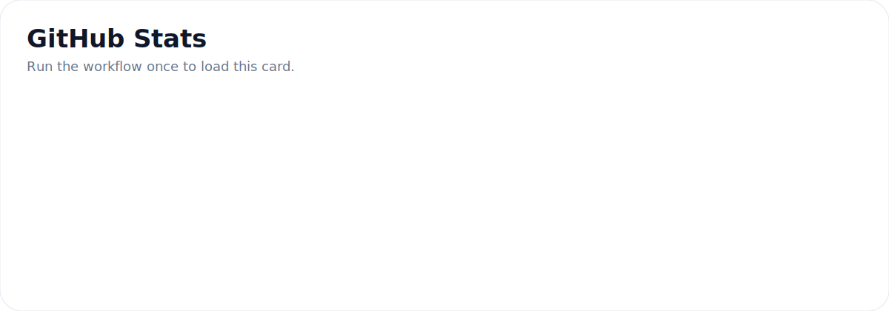
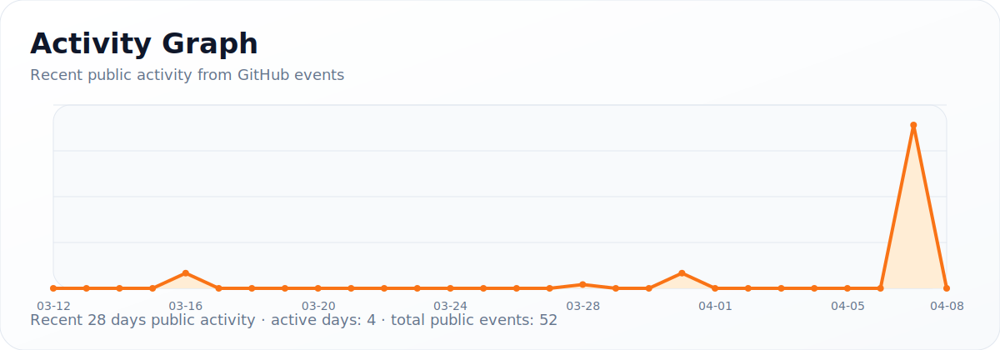
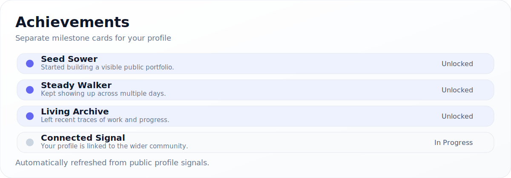

 
 

---

## 🌿 About Me

###

반갑습니다.

제 이름은 김은학이며, 현재 영남대학교에 재학 중입니다.

제 GitHub에 방문해 주신 모든 분들께 진심으로 감사드립니다.

시간은 유수와 같아, 어느덧 겨울이 지나고 푸른 들판에 씨를 뿌리는 생명의 계절이 찾아왔습니다.

요즈음 들어 삶은 결국 이와 같이 뿌리고 거두는 일이라는 생각을 자주 하게 됩니다.

당장은 보이지 않을지라도, 정성껏 심은 마음과 시간은 끝내 제 계절을 만나기 마련입니다.

당신으로 말미암아 발화된 작은 싹 하나도 언젠가는 누구보다 크고 아름다운 꽃봉오리로 돋아나겠지요.

기름진 들판에 씨를 뿌리고, 그것이 여문 여러분의 앞날에  
부디 행복이 있기를 바랍니다. 🌾✨

###

Hello, and welcome.

My name is Eunhak Kim, and I am currently studying at Yeungnam University.

I would like to sincerely thank everyone who has taken the time to visit my GitHub.

Time flows like running water, and before I knew it, winter had passed and the season of life arrived — the season in which seeds are sown across green fields.

Lately, I often find myself thinking that life, too, is much the same: an act of sowing and reaping.

Though not everything is visible at once, the heart and time we have carefully planted will, in the end, meet their own season.

Even the smallest sprout kindled through you will one day rise into a flower bud more beautiful and abundant than any other.

As seeds are scattered across a fertile field,  
may all that you have sown ripen gently in the days ahead,  
and may happiness remain with you. 🌿🤍

---

## 🛠️ Tech Stack

### 💻 Languages

  
  
  

### ⚙️ Tools

  
  
  
  
  

### 📚 Currently Learning

  
  
  
  

---

## 🌐 Goal

###

🌐 세상은 단순히 0과 1로만 쓰여지는 게 아닙니다.

세상은 이분법으로는 설명할 수 없는 수많은 관계와 감정, 맥락이 얽혀 지금의 복잡하고도 아름다운 세상을 이루고 있습니다.

저는 현실 세계와 가상 세계를 잇는 도구를 개발하여, 사람들의 삶을 더욱 풍요롭고 윤택하게 만드는 데 기여하고 싶습니다. ✨

###

🌐 I believe the world cannot be defined by 0s and 1s alone.

It is a complex yet beautiful place, shaped by countless relationships, emotions, and contexts that go far beyond simple binary thinking.

I aspire to build tools that bridge the real world and the virtual world, contributing to a richer and more meaningful life for people. ✨

---

## 📊 GitHub Stats

  

---

## 📈 Activity Graph

  

---

## 🏅 Achievements

  

---

## 🕯️ Motto

> 🕊️ Do not be broken by harsh truths, nor seduced by hollow ideals.  
> 🍂 Do not place your heart in things destined to fade.  
> ✨ What disappears is not given to us to be worshiped forever,  
> but to walk beside us for a while,  
> and to share in the play of this world.

---

## 🤝 Connect

  

